# Hi there 👋

<!-- PHASE 1 — Banner -->
<!-- Add dark.svg and light.svg to your repo root after uploading them -->
<picture>
  <source media="(prefers-color-scheme: dark)"  srcset="dark.svg">
  <source media="(prefers-color-scheme: light)" srcset="light.svg">
  
</picture>

 

<!-- PHASE 2 — Stats cards -->
<!-- ⚠️ Replace loki0107.vercel.app with your deployed Vercel URL after self-hosting -->
<!-- See setup checklist below for how to do this -->

  <!-- Streak card — full width -->
  

   

  <!-- Stats + Top Langs side by side -->
  
  

> **Why `hide_rank=true`?** GitHub's rank is weighted by stars on your repos — a metric that favours popular open-source projects over real engineering skill. For a newer account doing meaningful work, the rank label is more misleading than useful, so it's hidden.

 

<!-- PHASE 3 — Contribution snake -->
<!-- Only add this AFTER the GitHub Action runs green at least once. -->
<!-- The output branch won't exist before that, and the image will 404. -->
<picture>
  <source media="(prefers-color-scheme: dark)"
          srcset="https://raw.githubusercontent.com/logesh-balaji/logesh-balaji/output/github-contribution-grid-snake-dark.svg">
  <source media="(prefers-color-scheme: light)"
          srcset="https://raw.githubusercontent.com/logesh-balaji/logesh-balaji/output/github-contribution-grid-snake.svg">
  
</picture>

 

<!-- PHASE 4 — Social badges -->

&nbsp;&nbsp;
&nbsp;&nbsp;
&nbsp;&nbsp;

